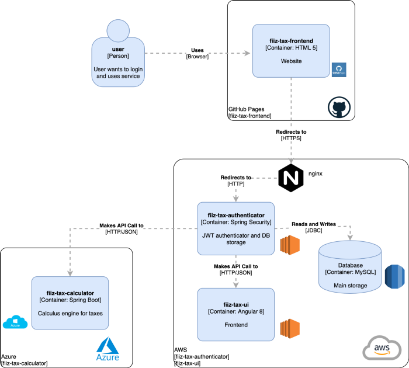

# FIIZ TAX Microservice

Microservice to calculate the taxes from [FII](http://www.b3.com.br/en_us/products-and-services/trading/equities/real-estate-investment-funds-fii.htm) sales in Brazil. 
This application is able to perform calculations with regards to taxes and 
profit from a FII transaction in the [B3](http://www.b3.com.br/en_us/)
.



###### Tecnologies
* Spring Boot 2.2.2
* Swagger 2
* JUnit 

## Build
```
mvn clean install
```

## Run
```
java -jar fiiz-tax-microservice-0.0.1-SNAPSHOT.jar
```
## Usage

This microservice will run in the port 8081 by default.
To access the swagger interface, go to:
```
http://localhost:8081/swagger-ui.html
```
## License
This project is licensed under the
MIT License - see the [LICENSE](LICENSE) file for details.
